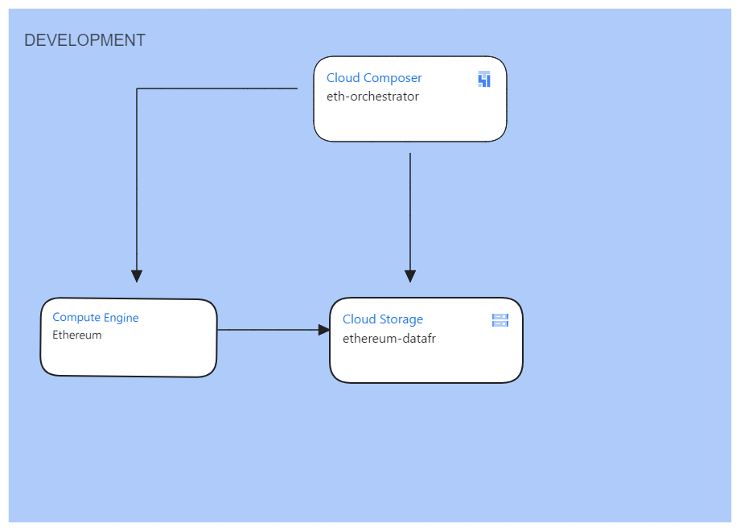

# GCP ELT Project with Cloud Composer, Compute Engine, and DBT

## Overview
This project implements an ELT (Extract, Load, Transform) pipeline on Google Cloud Platform (GCP). It is designed to collect, store, and prepare data for analytics purposes.

## Architecture

- **Data Collection**: Utilizes Google Cloud Compute Engine instances running Python scripts to gather data.
- **Data Storage**: The collected data is stored in Google Cloud Storage (GCS).
- **Data Orchestration**: Orchestrated with Cloud Composer, which manages workflow scheduling and execution.
- **Data Transformation**: Data preparation and transformation are handled using dbt (data build tool).

## Prerequisites
- Google Cloud Platform account
- Access to Cloud Composer, Compute Engine, GCS, and dbt

## Setup and Configuration
Provide detailed steps on setting up the environment:
1. Set up a Compute Engine instance for data collection.
2. Configure Cloud Composer for workflow orchestration.
3. Instructions on how to store data in GCS.
4. Steps for setting up and configuring dbt.

## Usage
Describe how to use the project, including how to run the Python scripts for data collection, trigger workflows in Cloud Composer, and execute dbt commands for data preparation.

## Contributing
Instructions on how contributors can help with your project.

## License
Specify the license under which the project is made available.

## Contact
Your contact information for users with questions or feedback.

## Acknowledgements
Credits to any third-party libraries or tools used in the project.
